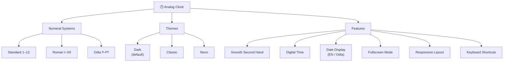

# Analog Clock

<div align="center">
  

  [](LICENSE)
  [](package-free)
  [](https://pages.github.com/)
  [](http://makeapullrequest.com)
</div>

A **polished, fully self-contained analog clock** built in a single HTML file — zero dependencies, canvas-rendered, deployable on GitHub Pages.


## ✨ Features

- **Canvas-rendered analog clock** with hour, minute, and second hands
- **Smooth continuous second hand** — no tick-step; sweeps at sub-millisecond precision
- **Three numeral systems** — toggle between Standard (1–12), Roman (I–XII), and Odia (୧–୧୨)
- **Three visual themes** — Dark (default, orange glow), Classic (warm serif), Neon (cyan/pink glow)
- **Digital time display** below the clock face
- **Date display** — day, month, and year with English or Odia names
- **Fullscreen mode** — click or press `F`
- **Responsive** — automatically resizes to fit any viewport
- **Keyboard shortcuts**:
  - `T` — cycle themes
  - `N` — cycle numeral systems
  - `D` — toggle date language
  - `F` — toggle fullscreen

## 🚀 Live Demo

[https://your-username.github.io/analog-clock/](https://your-username.github.io/analog-clock/)

*(Replace with your actual URL after deploying)*

## 🧩 Architecture



## 📁 Usage

1. **Download** the file:
   ```bash
   curl -O https://raw.githubusercontent.com/your-username/analog-clock/main/index.html
   ```
2. **Open** in any modern browser:
   ```bash
   open index.html
   ```
3. **Deploy** to GitHub Pages by pushing `index.html` to the `main` branch of a repo named `analog-clock`.

No build step. No package manager. One file.

## 🎨 Themes

| Theme     | Background | Accent  | Vibe                  |
|-----------|------------|---------|-----------------------|
| **Dark**  | `#0f0f1a`  | Orange  | Modern, moody         |
| **Classic** | `#f5f0e8` | Brown   | Warm, traditional     |
| **Neon**  | `#05050f`  | Cyan/Pink | Cyberpunk, glowing  |

## 🔤 Numeral Systems

| System     | Display                     |
|------------|-----------------------------|
| Standard   | 1 2 3 4 5 6 7 8 9 10 11 12 |
| Roman      | I II III IV V VI VII VIII IX X XI XII |
| Odia       | ୧ ୨ ୩ ୪ ୫ ୬ ୭ ୮ ୯ ୧୦ ୧୧ ୧୨ |

## 📄 License

MIT — see [LICENSE](LICENSE) for details.

---

*Built with ❤️ using vanilla JavaScript and Canvas API.*
